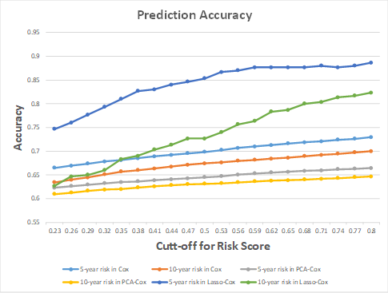

# All-causes-Mortality-Risk-Prediction

## Abstract
In this project, we implemented multiple ma-chine learning based survival analysis ap-proaches to estimates the risk of all causes mor-tality (the event of interests) using a longitudinal cohort data. The risk prediction models were build based on: general Cox model, Cox model with L1 penalty, Cox model fitting with PCA represented features, and Naïve Bayes account-ing for censoring. 

## Experiment result
Comparing the accuracy across methods, we observed that Lasso based Cox model has the best prediction performance, achieving as high as 88% and 82% accuracy when using a risk cut-off point of 0.8 for 5-year and 10-year mor-tality respectively. While, Cox model using PCA represented features has a relatively low predic-tive accuracy.
From the results (Figure 2), we see that the pre-diction accuracy is relatively higher for 5-year mortality prediction than 10-year risk prediction using the baseline features. This is what we ex-pected as the baseline information should be more informative in terms of relative “short-term” prediction. Cox model using PCA repre-sented features has a relatively low predictive accuracy. This may due to the fact that PCA constructs the representation vectors mainly based on the feature variance, which may not be able to pick the most informative representa-tion for event prediction. And the representation may also subject to high variance variables. In the real world, this type situation is hard to con-trol. On the other hand, we did observe an in-creased predictive accuracy when reducing per-centage of variances from 0.99 to 0.9, which means that PCA itself may help to filtered out some noise informative on some level when percentage of variances is in a certain range. However, we need point out the overall accura-cy is not as high as we expected. We assessed the ROC for three methods and none of the ROCs exceed 0.7. 

